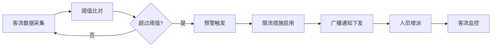

## 1. 产品概述

地铁车站公共安全联动 Web 平台，面向地铁运营中心、车站值班员和驻站警务人员，提供一站式的车站安全监控、预警、处置和复盘功能。

- 核心目的：提升地铁车站公共安全管理效率，实现多部门联动协同
- 解决问题：车站客流监控分散、事件响应迟缓、部门联动不畅、复盘缺乏数据支撑
- 目标用户：地铁运营中心调度员、车站值班员、驻站警务人员
- 产品价值：通过数据驱动的安全管理，降低安全事件发生率，提升应急响应速度

## 2. 核心功能

### 2.1 用户角色

| 角色 | 登录方式 | 核心权限 |
|------|----------|----------|
| 运营中心调度员 | 账号密码登录 | 全局监控、跨站调度、数据分析、配置管理 |
| 车站值班员 | 账号密码登录 | 本站监控、事件处置、物资管理、巡查安排 |
| 驻站警务人员 | 账号密码登录 | 警情查看、事件联动、人员布控、执法记录 |

### 2.2 功能模块

1. **运行看板**：客流峰值、滞留区域热力图、设备告警列表、警情状态面板
2. **站点地图**：闸机、扶梯、出入口、安检点、摄像头位置标注与状态
3. **客流预警**：阈值配置、限流措施管理、广播模板编辑
4. **事件处置**：拥挤、物品遗失、纠纷、可疑人员、突发伤病等事件登记与跟踪
5. **巡查管理**：岗位安排、巡査路线、打卡记录、异常上报
6. **联动联络**：一键通知警务、医护、消防、站务等部门
7. **物资管理**：围栏、担架、急救包、扩音器等物资台账与调度
8. **复盘分析**：处置时长统计、责任节点追溯、改进项跟踪

### 2.3 页面详情

| 页面名称 | 模块名称 | 功能描述 |
|-----------|-------------|---------------------|
| 运行看板 | 客流概览 | 实时客流、峰值数据、趋势图表 |
| 运行看板 | 滞留区域 | 热力图展示、区域滞留时长统计 |
| 运行看板 | 设备告警 | 告警列表、级别分类、处理状态 |
| 运行看板 | 警情状态 | 进行中警情、处置进度、响应时长 |
| 站点地图 | 地图展示 | 车站平面图、设备位置标注 |
| 站点地图 | 设备详情 | 点击查看设备状态、历史数据 |
| 客流预警 | 阈值设置 | 不同区域客流阈值配置 |
| 客流预警 | 限流措施 | 限流方案配置与启用 |
| 客流预警 | 广播模板 | 广播内容编辑与一键下发 |
| 事件处置 | 事件列表 | 待处理、处理中、已完成事件 |
| 事件处置 | 事件登记 | 事件类型、位置、描述、照片上传 |
| 事件处置 | 处置流程 | 步骤指引、人员指派、状态更新 |
| 巡查管理 | 岗位排班 | 人员岗位安排、班次管理 |
| 巡查管理 | 路线规划 | 巡查点设置、路线优化 |
| 巡查管理 | 打卡记录 | GPS打卡、签到时间统计 |
| 联动联络 | 联系人列表 | 各部门联系人、联系方式 |
| 联动联络 | 一键通知 | 电话、短信、站内广播通知 |
| 物资管理 | 物资台账 | 物资分类、数量、位置管理 |
| 物资管理 | 调度记录 | 物资借用、归还、维修记录 |
| 复盘分析 | 数据统计 | 处置时长、事件类型分布 |
| 复盘分析 | 责任节点 | 事件处置流程节点追溯 |
| 复盘分析 | 改进项 | 问题记录、整改措施、跟踪状态 |

## 3. 核心流程

### 3.1 安全事件处置流程

### 3.2 客流预警响应流程

## 4. 用户界面设计

### 4.1 设计风格

- **主色调**：深蓝色系（#1E3A8A）作为主色，代表专业、可靠
- **辅助色**：橙色（#F97316）用于告警和强调，绿色（#10B981）表示正常，红色（#EF4444）表示紧急
- **中性色**：深灰（#1F2937）、中灰（#6B7280）、浅灰（#F3F4F6）
- **按钮风格**：直角或微圆角（4px），强调专业感，悬停有深色过渡
- **字体**：标题使用 "Noto Sans SC" 粗体，正文使用 "Noto Sans SC" 常规
- **布局风格**：模块化卡片布局，顶部导航 + 左侧菜单 + 内容区三栏结构
- **图标风格**：使用 Lucide 图标库，线性风格，统一 24px 尺寸
- **整体风格**：工业科技风，专业严谨，适合监控中心大屏展示

### 4.2 页面设计概览

| 页面名称 | 模块名称 | UI 元素 |
|-----------|-------------|-------------|
| 运行看板 | 整体布局 | 四象限布局、数据卡片、实时更新、深色背景 |
| 站点地图 | 地图展示 | SVG 平面图、设备标记点、状态色标、悬浮详情 |
| 客流预警 | 阈值设置 | 滑块控件、数值输入、区域选择、保存按钮 |
| 事件处置 | 事件列表 | 表格展示、状态标签、筛选器、分页 |
| 巡查管理 | 路线规划 | 地图标注、拖拽排序、时间轴展示 |
| 联动联络 | 一键通知 | 大尺寸按钮、状态反馈、确认弹窗 |
| 物资管理 | 物资台账 | 卡片网格、数量徽章、状态图标 |
| 复盘分析 | 数据统计 | 柱状图、饼图、折线图、数据表格 |

### 4.3 响应式

- Desktop-first 设计，支持 1920x1080 及以上分辨率
- 适配监控中心大屏展示
- 平板端自适应布局，菜单可折叠
- 触摸屏优化：按钮最小尺寸 44x44px
