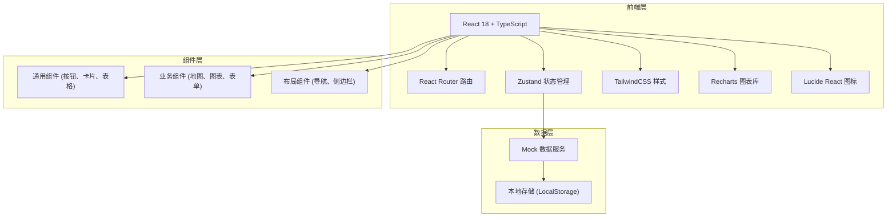
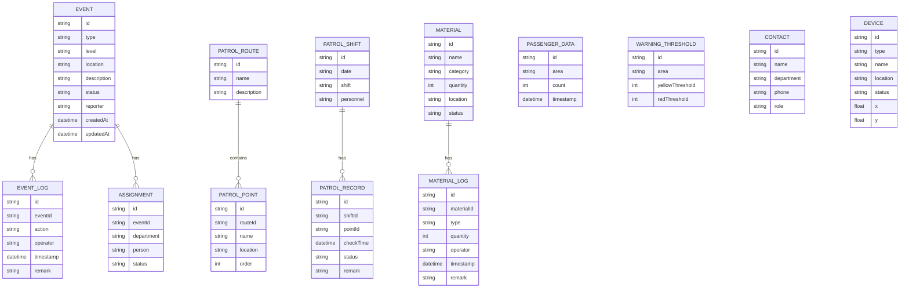

## 1. 架构设计



## 2. 技术描述

- **前端框架**: React@18 + TypeScript
- **构建工具**: Vite@5
- **路由管理**: react-router-dom@6
- **状态管理**: zustand@4
- **样式方案**: tailwindcss@3
- **图表库**: recharts@2
- **图标库**: lucide-react@0.344
- **后端**: 无后端，使用 Mock 数据模拟
- **数据持久化**: LocalStorage

## 3. 路由定义

| 路由 | 页面 | 说明 |
|-------|---------|------|
| /dashboard | 运行看板 | 首页，展示客流、告警、警情概览 |
| /station-map | 站点地图 | 车站平面图与设备位置 |
| /passenger-warning | 客流预警 | 阈值设置、限流、广播管理 |
| /event-handling | 事件处置 | 事件登记、列表、处置流程 |
| /patrol | 巡查管理 | 岗位、路线、打卡管理 |
| /contact | 联动联络 | 部门联系人、一键通知 |
| /materials | 物资管理 | 物资台账、调度记录 |
| /review | 复盘分析 | 统计数据、责任节点、改进项 |

## 4. 数据模型

### 4.1 数据模型定义



### 4.2 类型定义

```typescript
// 事件类型
type EventType = 'crowd' | 'lost_item' | 'dispute' | 'suspicious' | 'injury' | 'other';
type EventLevel = 'low' | 'medium' | 'high' | 'emergency';
type EventStatus = 'pending' | 'processing' | 'completed' | 'closed';

interface Event {
  id: string;
  type: EventType;
  level: EventLevel;
  location: string;
  description: string;
  status: EventStatus;
  reporter: string;
  createdAt: string;
  updatedAt: string;
  images?: string[];
}

// 客流数据
interface PassengerData {
  id: string;
  area: string;
  count: number;
  timestamp: string;
}

// 设备类型
type DeviceType = 'gate' | 'escalator' | 'entrance' | 'security' | 'camera';

interface Device {
  id: string;
  type: DeviceType;
  name: string;
  location: string;
  status: 'normal' | 'warning' | 'fault';
  x: number;
  y: number;
}

// 物资
type MaterialCategory = 'fence' | 'stretcher' | 'first_aid' | 'megaphone' | 'other';

interface Material {
  id: string;
  name: string;
  category: MaterialCategory;
  quantity: number;
  location: string;
  status: 'available' | 'in_use' | 'maintenance';
}

// 联系人
interface Contact {
  id: string;
  name: string;
  department: 'police' | 'medical' | 'fire' | 'station' | 'operation';
  phone: string;
  role: string;
}
```

## 5. 项目目录结构

```
src/
├── components/          # 通用组件
│   ├── Layout/         # 布局组件
│   ├── UI/             # 基础UI组件
│   └── charts/         # 图表组件
├── pages/              # 页面组件
│   ├── Dashboard/
│   ├── StationMap/
│   ├── PassengerWarning/
│   ├── EventHandling/
│   ├── Patrol/
│   ├── Contact/
│   ├── Materials/
│   └── Review/
├── store/              # Zustand 状态管理
├── types/              # TypeScript 类型定义
├── utils/              # 工具函数
├── data/               # Mock 数据
├── App.tsx
├── main.tsx
└── index.css
```
